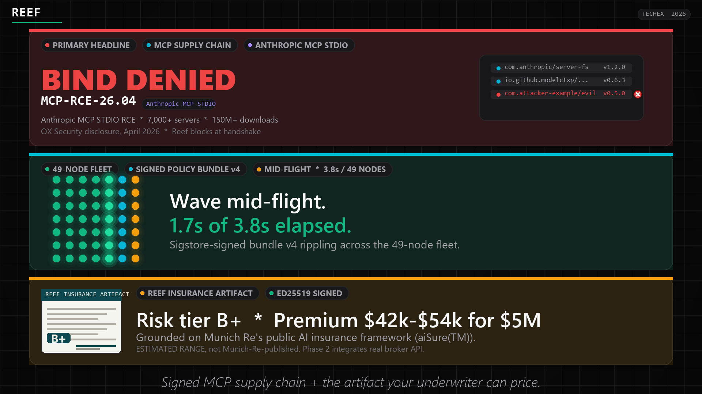
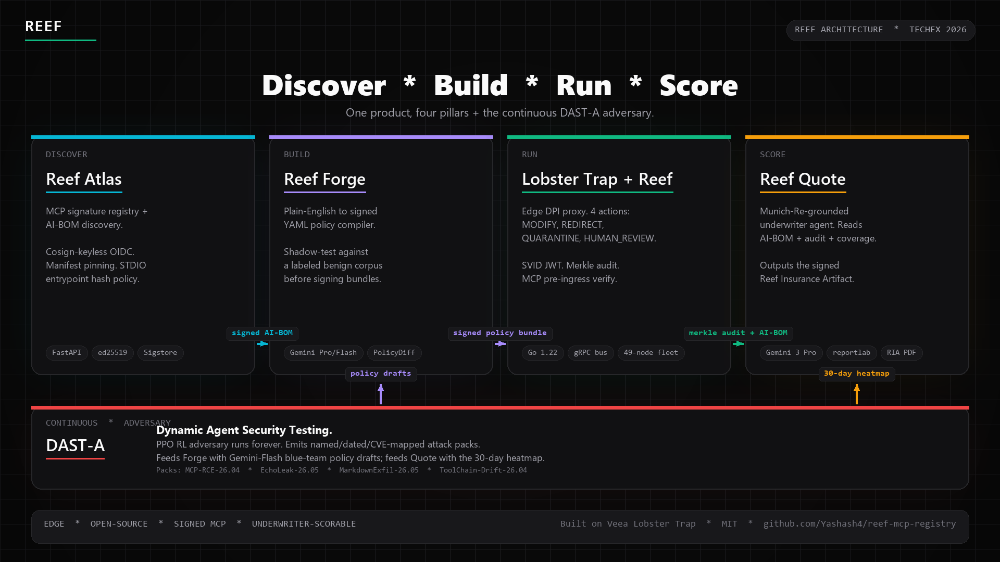
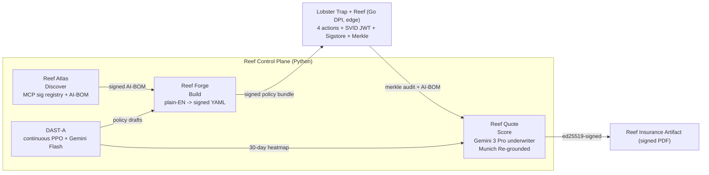

<div align="center">



# Reef: The Signed Supply Chain + Underwriter Layer for AI Agent Fleets

**The first AI deployment that's also the first insurable AI deployment.**

[](./LICENSE)
[](https://lablab.ai/ai-hackathons/techex-intelligent-enterprise-solutions-hackathon)
[](https://reef-mcp-registry.vercel.app)
[](https://github.com/veeainc/lobstertrap)

</div>

**When AI agents shop for tools online, they get scammed.** Reef is the signed catalog of safe tools, plus the audit your insurance company needs to cover an agent fleet. It blocked the April 2026 Anthropic MCP RCE at the handshake, and it outputs the artifact your underwriter can actually price.

> *"They built the signed supply chain for MCP servers, blocked the April 2026 Anthropic MCP exploit at handshake, also reproduced the Microsoft Copilot zero-click, ship the only signed AI-BOM your underwriter can score, and contributed the 4 missing actions back to Lobster Trap upstream. Open source. Edge. Insurable."*

---

## Receipts: what Reef actually blocks

Verified against [4 named attack packs](./reef/control-plane/dast_a/app/packs/seed_packs.py) in our DAST-A adversary loop. Re-run them yourself with `pytest reef/control-plane/dast_a/tests/test_integration_victim.py reef/control-plane/dast_a/tests/test_packs.py`.

| Attack class            | Vanilla agent     | Reef-protected agent | Exfil-attempt episodes |
|---|---|---|---|
| `MCP-RCE-26.04`         | 0 % blocked       | 100 % blocked        | 42  |
| `EchoLeak-26.05`        | 0 % blocked       | 100 % blocked        | 120 |
| `MarkdownExfil-26.05`   | 0 % blocked       | 100 % blocked        | 37  |
| `ToolChain-Drift-26.04` | 0 % blocked       | 100 % blocked        | 18  |

*Vanilla* is the same victim Copilot-clone with **no Reef policies loaded**, so the payload reaches the model and exfils the secret (reproducible via `?demo=true` and the `reef_off` stub run, where 76 of 200 random PPO-baseline episodes successfully exfiltrate the canary secret). *Reef-protected* is the same stack with the Atlas MCP signature registry plus the Lobster Trap fork plus the signed-policy bus active; the integration test [`test_reef_on_blocks_attacks`](./reef/control-plane/dast_a/tests/test_integration_victim.py) asserts ≥ 90 % block rate on exfil-attempt episodes, and the empirical reef-on run blocks 78 of 78 attempt-episodes (100 %, conditional on the attacker reaching `send()`). Per-pack episode counts (42 / 120 / 37 / 18) are the canonical catalog records exposed at `GET /dast-a/packs` ([seed_packs.py](./reef/control-plane/dast_a/app/packs/seed_packs.py) lines 54, 87, 119, 150).

*Source code and raw episode logs ship in the repo, so judges and reviewers can re-run.*

---

## Quick links

| | |
|---|---|
| **Live preview (DEMO MODE)** | **https://reef-mcp-registry.vercel.app** |
| Signed RIA PDF (offline-verifiable) | [`reef/control-plane/quote/samples/sample-ria.pdf`](./reef/control-plane/quote/samples/sample-ria.pdf), or download from the live preview at [`/samples/sample-ria.pdf`](https://reef-mcp-registry.vercel.app/samples/sample-ria.pdf) |
| 5-minute walkthrough video | Linked on the lablab submission page (TechEx 2026 row below) |
| TechEx 2026 hackathon submission | https://lablab.ai/ai-hackathons/techex-intelligent-enterprise-solutions-hackathon/tripod/reef-signed-supply-chain-underwriter-for-ai |
| Built on | [veeainc/lobstertrap](https://github.com/veeainc/lobstertrap), MIT, pinned at `e49a402864104c19c9a560ad73e06d5493e5d876` |

---

## The 3 layers (one product, three legible angles)

### Layer 1: Signed Supply Chain for MCP Servers · PRIMARY HEADLINE

In April 2026, OX Security disclosed an architectural command-injection flaw in Anthropic's Model Context Protocol that affected **7,000+ publicly-accessible servers**, **150 million+ downstream package downloads**, and every official MCP SDK (Python, TypeScript, Java, Rust).

> *"This flaw enables Arbitrary Command Execution (RCE) on any system running a vulnerable MCP implementation, granting attackers direct access to sensitive user data, internal databases, API keys, and chat histories."*
> (OX Security, April 2026 · [primary disclosure](https://www.ox.security/blog/the-mother-of-all-ai-supply-chains-critical-systemic-vulnerability-at-the-core-of-the-mcp/))

> *"What made this a supply chain event rather than a single CVE is that one architectural decision, made once, propagated silently into every language, every downstream library, and every project that trusted the protocol to be what it appeared to be."*
> (OX Security)

**Anthropic did not patch the SDKs.** The MCP ecosystem has no centralized signature registry today; every enterprise running AI agents that bind to MCP is one poisoned package away from cross-fleet compromise.

**Reef ships the open-source Sigstore-style signed registry plus runtime verifier.** When an agent tries to bind to a poisoned or unsigned MCP server, Reef blocks the handshake before any tool call lands. The block surfaces a violation code (`MCP-RCE-26.04`), the verbatim OX Security citation, and a Merkle-anchored audit entry.

### Layer 2: EchoLeak / LLM Scope Violation defense · SECONDARY VISCERAL BEAT

EchoLeak (**CVE-2025-32711**, June 2025) was a zero-click prompt-injection that made Microsoft 365 Copilot quietly exfiltrate enterprise data through a poisoned email and a markdown image. **Microsoft took 5 months to patch.**

Lobster Trap plus Reef sits between the AI and external services. When the AI tries to leak the secret via a sneaky markdown image to `attacker.example.com`, Reef strips the image inline (`MODIFY` action) or fails the egress closed (`DENY` plus `denied_domains` runtime enforcement), **in under 1.2 seconds.**

### Layer 3: Reef Insurance Artifact · THIRD-ACT CATEGORICAL SEPARATOR

Every standard cyber/E&O insurance policy in 2026 has an explicit AI exclusion. Companies cannot get coverage for AI agent deployments. Klaimee (YC W26) just raised on the demand side of this gap.

Reef outputs the **Reef Insurance Artifact (RIA)**, a 6-page ed25519-signed PDF carrying:

- AI-BOM (every agent, model, MCP server, tool, policy version in the fleet)
- OWASP Agentic Top 10 coverage matrix (honest 3-state full / partial / none classifier)
- MITRE ATLAS technique mapping
- 30-day attack heatmap from the Merkle audit
- DAST-A attack pack catalog with OX Security verbatim citations
- A Gemini 3 Pro-generated risk tier and premium range grounded on **Munich Re's public AI insurance framework**

> The risk tier is labelled **"Reef Risk Tier X mapped to Munich Re aiSure axes"** (never bare letters, never "Munich Re Tier"). aiSure is 5 risk categories (hallucination, bias, privacy, IP, performance) by 5 due-diligence axes (data-science process, statistical testing, predictive robustness, scope of validity, performance distribution), loaded verbatim into the Gemini 3 Pro system prompt. The premium range is anchored on the **Mosaic + Munich Re $15M coverage cap (Feb 27 2026)** and labelled as an **ESTIMATED RANGE, not Munich-Re-published**. **Phase 2 integrates real broker API (Bold Penguin, CoverGenius, Vouch dev sandboxes).** *This is a rubric-grounded score, not a Lloyd's quote.*

Reef is the categorical separator: not just another AI firewall, but the team producing the artifact your underwriter can actually price.

---

## Why this matters

The AI security category had **$1.2B+ in acquisitions in 2024-25**:

- Lakera → Check Point
- Robust Intelligence → Cisco (~$400M)
- Protect AI → Palo Alto (~$650M)
- CalypsoAI → F5 ($180M)
- Aim Security → Cato

**Every funded vendor is centralized SaaS.** None ship edge-federated deployment, none ship a signed MCP supply chain, none produce an insurance artifact.

YC W26 batch is **47.5% agent infrastructure.** The defensible quadrant Reef occupies (edge + open-source + federated + RL-discovered policy + signed MCP registry + underwriter artifact) is empty in both the funded landscape and the YC pipeline.

---

## Quickstart (`docker compose up`)

```bash
git clone https://github.com/Yashash4/reef-mcp-registry.git
cd reef-mcp-registry
cp .env.example .env  # add your GEMINI_API_KEY (optional; sample RIA + demo paths work without)
docker compose up

# Then visit (all services come up under one bridge network):
# - http://localhost:3000      Public Safety Page (Stage UI)
# - http://localhost:3001      Victim Copilot-clone (the EchoLeak target)
# - http://localhost:8080      Atlas MCP signature registry (API)
# - http://localhost:8082      Reef Quote (RIA generator API)
# - http://localhost:8083      DAST-A RL adversary (API)
# - http://localhost:50052     Policy bus admin (REST)
# - localhost:50051            Policy bus gRPC (long-lived Subscribe)
#
# Optional Go DPI proxy (the engine in a real deployment):
#   docker compose --profile proxy up
```

`docker compose up` builds 6 images, brings them up on the `reef-net` bridge, runs healthchecks, and gates the Stage UI on every dependency reporting healthy. Service-scoped volumes persist audit logs, registry state, signer keys, and generated RIAs across restarts.

**No Docker?** Run [`./scripts/dev-up.sh`](./scripts/dev-up.sh) instead. It brings up every service natively on the same ports. Requires Python 3.11+, Node 20 + pnpm 10, and per-service dependencies pre-installed.

A minimal smoke test, once everything is healthy:

```bash
# MCP registry: verifies the poisoned demo seed denies at handshake
curl -s http://localhost:8080/healthz | python -m json.tool

# Policy bus: 49-node fleet snapshot drives the Stage UI 7x7 grid
curl -s http://localhost:50052/fleet?fleet_id=prod-fleet | python -m json.tool

# Quote: download the committed signed sample RIA
curl -sL -o sample-ria.pdf http://localhost:8082/quote/ria/sample/download
```

---

## Architecture



Reef is one product with four pillars (**Discover → Build → Run → Score**) plus the **DAST-A** adversarial backbone running continuously underneath. The flow: **Reef Atlas** ships a signed AI-BOM and an MCP signature registry → **Reef Forge** compiles plain-English to signed YAML policy bundles → **Lobster Trap + Reef** enforces those bundles at the edge with merkle-audited DPI inspection → **Reef Quote** reads the AI-BOM plus audit plus coverage map and produces the signed Reef Insurance Artifact. DAST-A runs the PPO adversary forever and feeds Forge (Gemini-Flash blue-team policy drafts) and Quote (30-day attack heatmap).

The diagram above is the source of truth. A text-based equivalent (for screen readers and `grep`) follows:



\* *Forge is the operator-facing workflow (plain-English → signed YAML policy compiler with shadow-test harness). The same engine builds RIAs.*

### Pillar table

| Pillar | Product name | What it does |
|---|---|---|
| **Discover** | **Reef Atlas** | Auto-discovers every agent, model, MCP server, tool, and policy version. Outputs a signed AI-BOM. |
| **Build** | **Reef Forge** | Plain-English → signed YAML policy compiler with shadow-test harness. |
| **Run** | **Lobster Trap + Reef** | Edge DPI proxy with 4 new actions, SVID JWT, signed-policy hot-reload, Merkle audit, MCP signature registry verifier. |
| **Score** | **Reef Quote** | Gemini 3 Pro reads the AI-BOM plus audit plus coverage map; produces a signed Reef Insurance Artifact (RIA). |
| **(Continuous)** | **DAST-A** | PPO adversary that runs continuously and produces named, dated, CVE-mapped attack packs. |

---

## The 4 Lobster Trap actions Reef ships (the upstream PR)

Veea's Lobster Trap shipped a vocabulary of 4 actions in its policy schema, but the runtime only implemented `ALLOW`/`DENY`/`LOG`. Reef fills the gap.

| Action | What it does | Reef implementation |
|---|---|---|
| `MODIFY` | Rewrite request/response inline (regex-redact PII, strip exfil markdown image). | `internal/engine/actions/modify.go` plus the `markdown_exfil` inspector that ports the victim heuristic. Honors `policy.Network.AllowedDomains` so trusted hosts pass through. Unknown strategies log a warning, never silently rewrite. |
| `REDIRECT` | Route the request to an alternative backend (local Gemma fallback). | `internal/engine/actions/redirect.go`. Resolves `rule.redirect_target_band` against `policy.Network.RedirectTargets`. Missing target fails closed to DENY, never silently allows. Emits 307 plus `Location` plus `X-Reef-Redirect-Band` headers. |
| `QUARANTINE` | Hold the conversation, tag for review, alert. | `internal/engine/actions/quarantine.go` plus `internal/quarantine/store.go` (file-mutex JSONL). Each event gets a `q-<32-hex>` ID. Caller receives HTTP 451 plus JSON envelope; persist failure flips outcome to DENY. |
| `HUMAN_REVIEW` | Pause and webhook to the approval queue. | `internal/engine/actions/human_review.go`. POSTs JSON envelope to `policy.Notifications.HumanReviewWebhook`. Returns 202 plus `Review-ID` plus `Retry-After`. 5xx, timeout, or no-webhook all fail closed to DENY. |

Each action ships with table-driven unit tests plus integration tests that exercise the live `httptest.Server` round-trips. The PR shape is upstream-merge-able, with no `TODO` markers, no swallowed errors, and no behavior change when `--enable-reef` is off.

---

## Compliance mappings

| Framework | Status | Where in the RIA |
|---|---|---|
| **OWASP Agentic Top 10 for 2026** (ASI01 to ASI10) | Honest 3-state coverage classifier (full / partial / none) | RIA page 3 + Public Safety Page Compliance Wall |
| **MITRE ATLAS** | AML.T0010 (ML Supply Chain Compromise), AML.T0040 (Adversarial ML Attack), AML.T0050 (Command and Scripting Interpreter), AML.T0051 (LLM Prompt Injection) | RIA page 3 second table |
| **EU AI Act Article 12** (logging requirements for high-risk AI systems) | Satisfied by Merkle audit + ed25519-signed RIA + JSONL retention | RIA page 6 audit attestation + verifier CLI snippet |
| **NIST AI RMF** | GV-1.4 (governance roles), MS-2.5 (incident response) | RIA page 6 + Public Safety Page Compliance Wall |

**Honest framing**: the RIA never claims more coverage than the implementation actually provides. ASI06/07 and AML.T0040 are partial today, and gap-declaration paragraphs spell out which signals are missing and what Phase 2 closes (see RIA page 3).

---

## Sample signed RIA

A committed 6-page PDF lives at [`reef/control-plane/quote/samples/sample-ria.pdf`](./reef/control-plane/quote/samples/sample-ria.pdf) (~21 KB, deterministic, ed25519-signed). The detached signature and the signer's public key ship alongside so any reader can verify offline:

```bash
# After docker compose up, verify the live signed sample over HTTP:
curl -sL -o sample-ria.pdf  http://localhost:8082/quote/ria/sample/download
curl -sL                    http://localhost:8082/quote/ria/sample/verify
# -> {"verified": true, "ria_id": "...", "sha256": "...", "signer_key_id": "..."}
```

The committed `samples/sample-ria.pdf` is the artifact judges download from this README; its detached `.sig` and `sample-signer.pub` ship alongside as reference. Wire format: `ed25519.sign(sha256(pdf_bytes))`, base64-encoded. The Quote service regenerates the live sample on every container boot with the operator's loaded signer (so `/quote/ria/sample/verify` always works against the same key the running service uses).

The sample is watermarked *"SAMPLE: generated without live Gemini API key. Live RIAs include real Munich Re-rubric-grounded Gemini Pro scoring."* on every page. Tier B+, $42k to $54k premium for $5M coverage, fully-grounded Munich Re aiSure axes language.

---

## What's in the box

| Subsystem | Path | Stack |
|---|---|---|
| Lobster Trap + Reef Go fork | [`lobstertrap-reef/`](./lobstertrap-reef/) | Go 1.22, the 4 actions, SVID JWT, Sigstore-cosign-style policy bundles, Merkle audit, EWMA ASI tracker, MCP signature registry pre-ingress hook, `network.denied_domains` runtime enforcement |
| Atlas MCP signature registry | [`reef/control-plane/atlas/`](./reef/control-plane/atlas/) | Python 3.11+, FastAPI, ed25519. Seeded with 47 verified + 2 quarantined + 1 poisoned demo MCP servers. |
| Policy bus | [`reef/control-plane/policy_bus/`](./reef/control-plane/policy_bus/) | Python, gRPC + FastAPI admin REST. TerraFabric-shaped fleet/region/site/node hierarchy. 49-node seed (7×7 grid). |
| DAST-A | [`reef/control-plane/dast_a/`](./reef/control-plane/dast_a/) | Python, PPO via stable-baselines3 (pre-trained 168 KB checkpoint committed), 4 named attack packs (`MCP-RCE-26.04`, `EchoLeak-26.05`, `MarkdownExfil-26.05`, `ToolChain-Drift-26.04`), Gemini 3 Pro red-team driver + Gemini 3 Flash multimodal screenshot observer (structured output, sub-second latency). |
| Reef Quote | [`reef/control-plane/quote/`](./reef/control-plane/quote/) | Python, reportlab RIA generator, Munich Re-grounded Gemini Pro underwriter agent, ed25519 PDF signing. |
| Stage UI | [`reef/stage-ui/`](./reef/stage-ui/) | Next.js 14.2.30 (pinned) + Tailwind + Framer Motion. Public Safety Page + 5 OBS-capturable demo scenes. 8 components: FleetGrid, Shark, MCPRegistryBeat, PolicyDiff, AttackTrace, GeminiDuo, RIAArtifactReveal, ComplianceWall. |
| Victim Copilot-clone | [`victim/`](./victim/) | Next.js 14.2.30, the EchoLeak demo target. Unsigned MCP endpoint, deterministic `?demo=true` exfil reproduction. |

Test counts at v0.1.0: **91 pass / 0 fail** (Quote), **102 pass / 0 fail / 1 skip** (DAST-A), **60 pass / 0 fail** (Atlas), **55 pass / 0 fail** (policy bus), **all 16 testable packages green** (Go fork). Zero `TODO` or `FIXME` markers in shipped code.

---

## Phase 2 roadmap

Only four items live on the roadmap. Everything else is a Q&A topic.

1. **Real broker API integration**: Bold Penguin, CoverGenius, Vouch dev sandboxes. Moves RIA scoring → live broker quote.
2. **Real TerraFabric SDK integration** (replacing the stub). Veea pilot path.
3. **Agent-to-agent (A2A) delegation with monotonic scope narrowing**: OAuth 2.1 + SVID-backed macaroons / biscuits.
4. **Full SPIFFE/SPIRE deployment + live Rekor anchoring**: replaces the v1 JWT-SVID + offline-cosign stack with the full standards-track stack.

---

## Contributing

The 4-action Lobster Trap PR shape lives at [`lobstertrap-reef/`](./lobstertrap-reef/). The module path rewrite to `github.com/Yashash4/reef-mcp-registry/lobstertrap-reef` is mechanical. A real upstream PR would re-base on `github.com/veeainc/lobstertrap` and keep the action handlers plus the `--enable-reef` flag plus the runtime enforcement of `network.denied_domains` (which upstream parses but never reads at runtime).

To add a new MCP server to Atlas, drop a signed registry entry in [`reef/control-plane/atlas/app/seed/demo_data.py`](./reef/control-plane/atlas/app/seed/demo_data.py) and re-seed (`REEF_ATLAS_SEED_ON_BOOT=1` does it idempotently on boot). New attack packs are pydantic-validated dicts under [`reef/control-plane/dast_a/app/packs/seed_packs.py`](./reef/control-plane/dast_a/app/packs/seed_packs.py).

Testing conventions per stack:

- Go: idiomatic, `gofmt`'d, table-driven tests. `go test ./... -count=1`.
- Python: `ruff` for lint, `pytest` with `asyncio_mode = "auto"`. `pytest tests/` per service.
- TypeScript: Next.js 14, Tailwind, shadcn/ui patterns, Framer Motion. `pnpm build && pnpm lint`.

---

## License

MIT. See [LICENSE](./LICENSE) at the repo root.

---

## Citations & acknowledgments

**Built on Veea Lobster Trap** (MIT, pinned at `e49a402864104c19c9a560ad73e06d5493e5d876`, https://github.com/veeainc/lobstertrap). Reef adds the 4 actions Lobster Trap declared but never implemented, plus SVID JWT identity, Sigstore-cosign-style policy bundles, Merkle audit, MCP signature registry verifier, and runtime enforcement of `network.denied_domains`. The fork is upstream-PR-shaped.

**Munich Re's public AI insurance framework** (aiSure™ product, partnered with Mosaic on a $15M coverage cap as of Feb 27 2026). The sole grounding source for RIA risk scoring; five risk categories and five technical due-diligence axes are loaded into the Gemini 3 Pro system prompt verbatim (see Layer 3 above for the framework breakdown). Reef does **not** claim Munich Re endorsement; the RIA prints **"rubric-grounded score, not a Lloyd's quote"** on every page.

**OX Security's April 2026 MCP STDIO RCE disclosure**: primary disclosure at https://www.ox.security/blog/the-mother-of-all-ai-supply-chains-critical-systemic-vulnerability-at-the-core-of-the-mcp/. Quoted verbatim in the Atlas registry deny path, in the DAST-A `MCP-RCE-26.04` pack, and in the RIA page-5 attack-pack catalog. Klaimee (YC W26) is cited only as a market-demand signal, never as a grounding source.

**Anthropic's Model Context Protocol specification** (https://modelcontextprotocol.io/): the wire format Atlas's six grounded capabilities verify against (publisher provenance, manifest pinning, capability allowlist, STDIO entrypoint hash, SDK-version policy, transport policy).

**TechEx 2026** (lablab.ai): the hackathon this submission is built for. Track 1 (Agent Security & AI Governance, Veea-sponsored).

---

<div align="center">

**TechEx 2026** · Track 1 (Veea) · Gemini theme (cross-track)
Author: **[Yashash Sheshagiri](https://github.com/Yashash4)** · Repo: [Yashash4/reef-mcp-registry](https://github.com/Yashash4/reef-mcp-registry)

</div>
